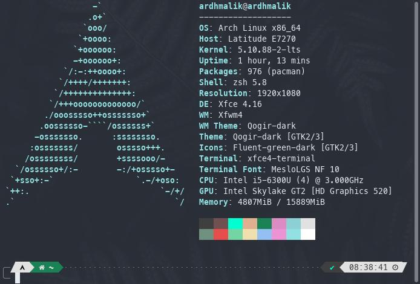

# **PROJECT SERTIFIKASI SISTEM ANALIS**
- [**PROJECT SERTIFIKASI SISTEM ANALIS**](#project-sertifikasi-sistem-analis)
  - [Latar Belakang](#latar-belakang)
  - [Tujuan](#tujuan)
  - [Spesifikasi](#spesifikasi)
  - [Tools](#tools)
  - [Unit Kompetensi](#unit-kompetensi)
  - [Hasil](#hasil)

## Latar Belakang
Dengan hadirnya Lembaga Sertifikasi di Univertisas Nusa Mandiri, maka mahasiswa diberikan kesempatan untuk mendapatkan sertifikasi sesuai bidang keahlian yang dimiliki. Tahun 2022 ini, merupakan giliran saya mendapatkan kesempatan tersebut sebagai bekal dalam mengarungi dunia pekerjaan nanti. Pada sertifikasi kali ini, yang akan diuji adalah kemampuan dalam membangun sebuah program dengan logika Searching dan Sorting, serta program CRUD dengan bahasa pemrograman yang dikuasai. Dalam hal ini saya akan menggunakan bahasa pemrograman PHP.

## Tujuan
Ada beberapa tujuan dalam kegiatan sertifikasi ini, antara lain:
- Membekali mahasiswa dengan sertifikat untuk menunjang karir
- Menguji kelayakan mahasiswa terjun di dunia pemrograman
- Melihat kemampuan mahasiswa dalam membangun sistem dengan kode yang tedokumentasi dengan baik dan nihil bug dan error

## Spesifikasi

Berikut adalah spesifikasi device/laptop yang saya miliki

| Device      |              Type |
| :---------- | ----------------: |
| **OS**      |    Arch Linux x64 |
| **Kernel**  |          5.10 LTS |
| **CPU**     |    Intel i5-6300U |
| **Memory**  |          15889MiB |
| **Storage** |             256GB |
| **GPU**     | Intel Skylake GT2 |

## Tools
Ada banyak tools yang dapat digunakan dalam pembuatan program kali ini, namun saya hanya akan menggunakan tools pada tabel berikut:
| Name        |                                                                                                                                            Icon |              Website               |
| :---------- | ----------------------------------------------------------------------------------------------------------------------------------------------: | :--------------------------------: |
| PHP         |                                |      [https://www.php.net/]()      |
| CodeIgniter |                                                                                  |    [https://codeigniter.com/]()    |
| VSCode      |  | [https://code.visualstudio.com/]() |
| Github      |                          |      [https://github.com/]()       |
| mariaDB     |                                                      |      [https://mariadb.org/]()      |

## Unit Kompetensi
Berikut adalah daftar kompetensi yang akan diuji pada pengujian sertifikasi sistem analis programmer kali ini, antara lain:
- J.620100.002.01 Menganalisis Skalabilitas Perangkat Lunak
- J.620100.020.02 Menggunakan SQL
- J.620100.021.02 Menerapkan Akses Basis Data
- J.620100.022.02 Mengimplementasikan Algoritma Pemrograman
- J.620100.023.02 Membuat Dokumen Kode Program
- J.620100.025.02 Melakukan Debugging
- J.620100.031.01 Melakukan Profiling Program 
- J.620100.032.01 Menerapkan Code Review 
- J.620100.033.02 Melaksanakan Pengujian Unit Program 
- J.620100.034.02 Melaksanakan Pengujian Integrasi Program

## Hasil
1. [Algoritma SEARCHING & SORTING]()
2. [CRUD CodeIgniter]()
